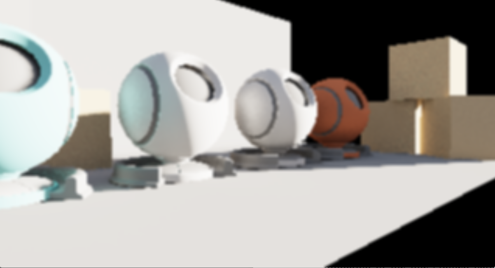

## CyanRenderEngine
******

#### TODOs
******
- [ ] Irradiance volume. (Currently there is only one irradiance probe which is sampled at the center of the "room" in the scene)
- [ ] Improve GTAO, specifically try to reduce noise by using some sort of filtering.
#### Asset Attribution
******
* The shaderball mesh is found at https://github.com/derkreature/ShaderBall licensed under "The Unlicense".
* The robot mesh in the scene downloaded from Sketchfab, and is based on "Metal Gear Mk. II" (https://sketchfab.com/3d-models/metal-gear-mk-ii-470c8b4e3b0d4e13a03d6def373995ef) by Tom Seddon (https://sketchfab.com/bloodmeat08) licensed under CC-BY-4.0 (http://creativecommons.org/licenses/by/4.0/).
* The medieval kight mesh and all the electric tower meshes are purchased from Sketchfab under Sketchfab's "Standard" license.
* The stanford bunny mesh is from Professor Morgan McGuire's [graphics archive](http://casual-effects.com/data/index.html).
* The gundam mesh in the scene is purchased from https://sketchfab.com/3d-models/gundam-rx-78-static-t-pose-mesh-2ba29a30ddaf44bc97c6c6ed0a55e1c2 under Sketchfab's "Editorial" license, and is used here only for educational purpose to help me practice my understanding of rendering techniques.
* The rest of meshes, such as the "Cornell Box" inspired room is modeld by myself in Blender :)
